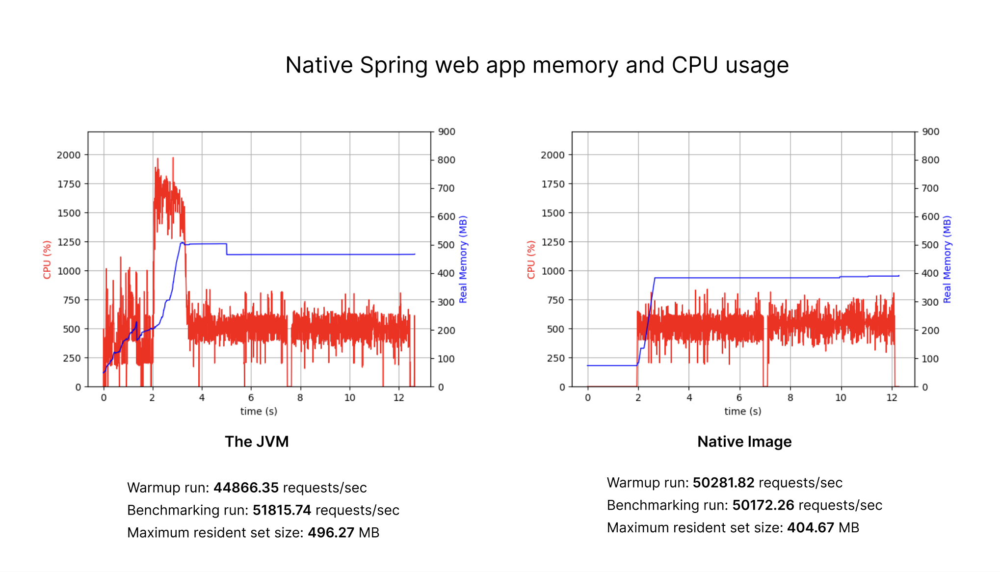

Hello, Java Magazine!👋

I'm very excited about this opportunity to talk with you in writing about GraalVM, Spring Boot, how they are even more awesome together, and why you should care. Let's go!

# What is GraalVM and why GraalVM

GraalVM is a JDK, just like OpenJDK or any other JDK of your choice, but with additional features and capabilities built on top of it. Let's explore them.

One such feature is the **GraalVM JIT compiler**. It's a brand new highly optimizing compiler, which is the outcome of over a decade of research at Oracle Labs.By moving to GraalVM JIT (by just setting GraalVM as your Java runtime), you ca n easily win extra 10-15% performance improvements. Not every application is performance-critical, but for those that are, every percent of performance improvement, especially with easy migration and no manual tuning required, is a huge win. This is confirmed by both large-scale organization, such as Oracle NetSuite, using GraalVM JIT in production at scale, and community reports, such the one from Ionut Balosin and Florin Blanaru (https://ionutbalosin.com/2024/02/jvm-performance-comparison-for-jdk-21/), where Oracle GraalVM JIT shows performance improvement of 23% on x86_64 and 17% on arm64 compared to the C2 JIT compiler. 

Another feature that GraalVM adds to the JDK is **Embedding other languages**. We are lucky to have the incredibly rich Java ecosystem at our fingertips – whenever we have a problem that needs a solving, there's always a Java library or tool for that. But sometimes we need to reach out for one specific library on another ecosystem, such as all the cool ML libraries in Python, or utilize the scripting capabilities of JavaScript. GraalVM, and more specifically its Truffle component, enables you doing just that: embedding what we call guest language code in your Java application. You use what you need to use, and we will take care of the rest: interoperability, performance, tooling, and security. This way you can combine the rich and powerful Java platform with any other library or tool that you like – how cool is that?

Now the last but not least is GraalVM's **Native Image**, which enables compiling Java applications ahead of time into small and fast native executables. This our main topic for today — let's dive in.

# Meet GraalVM Native Image

So what is Native Image and how does it work exactly? Native Image is a feature in GraalVM that employs the Graal compiler to ahead of time compile your Java application into a native executable. The main reason to do so is to shift the majority of the work that the JVM normally is doing at run time, such as loading classes, profiling, and compilation, to the build time, to remove that overhead when you run your application. In addition to AOT compilation, Native Image performs another important task: it takes a snapshot of your heap with objects that are safe to initialize at build time, to also reduce the allocation overhead. 

Native Image compiles your Java application into a native executable with the following advantages:

* Fast startup and instant performance, as the native executable doesn't need to warm up;
* Low memory footprint, as we don't need to profile and compile code at runtime;
* Peak performance on par with the JVM;
* Compact packaging due to including only reachable code;
* Additional security, as we eliminate unused code and reduce the attack surface.

 # Spring AOT: Spring meets GraalVM 🤝

Now let's talk about Spring Boot, GraalVM, and how they come together. Spring Boot 3.0 introduced general availability of GraalVM Native Image in Spring projects, and here is how it works.

By default Spring Boot works in a way that at runtime it pulls your project's source code and configuration from all the different sources, resolves it, and and creates an internal representation of your app. What's interesting, GraalVM Native Image does a very similar thing – it analyzes your code and configuration and creates an internal representation of your app – but it does this at build time. The Spring AOT engine was designed to bridge this gap between two worlds. It transforms your application configuration into native-friendly functional configuration and generates additional files to assist native compilation of Spring projects: 

* Java source code (functional configuration)
* Bytecode for things like dynamic proxies
* Runtime hints for dynamic Java features when necessary (reflection, resources, etc). 


# Build a Native Spring Application

Let's go to Josh Long's second favorite place — start.spring.io – and generate our project. The settings I chose are Spring Boot 3.3.1, Java 22, Maven, and my dependencies are Spring Web and GraalVM Native Image. That's all. Let's download and unpack our project, and add a `HelloController.java` so we have something to work with:

```java
package com.example.demo;

import org.springframework.web.bind.annotation.RestController;
import org.springframework.web.bind.annotation.GetMapping;

@RestController
public class HelloController {

    @GetMapping("/hello")
    public String hello() {
        return "Hello from GraalVM and Spring!💃";
    }
    
}
```
Guess what — we would also need GraalVM. The easiest way to install it with SDKMAN!. As I'm writing this article the latest released version is GraalVM for JDK 22, but we can also be cool and get the early access builds of GraalVM for JDK 23:

```shell
sdk install java 23.ea.9-graal

```

Now we are all set!

Remember GraalVM is a normal JDK, right? You can run your application as you would on any other JDK:

```shell
mvn spring-boot:run
...
Tomcat started on port 8080 (http) with context path '/'
Started DemoApplication in 1.106 seconds (process running for 1.363)
```

Navigate to `http://localhost:8080/hello` and you'll see our message. 

So far so good, but where's fun in that! Let's compile it to native executable with GraalVM Native Image:

```mvn -Pnative native:compile```

While this command looks simple on the surface, it invokes an elaborate process of analyzing your whole applications, pulling the configuration, finding the code that is reachable, snapshotting heap, and then optimizing and compiling. Look at the analysis step — even our fairly trivial app with two user classes (albeit also dependencies on Spring modules and JDK classes), has quite a few things inside:

```shell
[2/8] Performing analysis...  [*****]                                   (15.0s @ 1.53GB)
   16,960 reachable types   (89.4% of   18,971 total)
   26,038 reachable fields  (59.2% of   44,015 total)
   89,842 reachable methods (64.9% of  138,456 total)
```


On my fairly average Linux cloud instance (16 COU, 32 GB RAM) the build takes 1m 15s by default, and 46.7s with the quick build mode (`-Ob`). 

Now let's run our application:


```shell
./target/demo
...
Tomcat started on port 8080 (http) with context path '/'
Started DemoApplication in 0.048 seconds (process running for 0.051)

```

Navigating to `http://localhost:8080/hello` gives us the same message, only now our application is much faster – it started in 48 miliseconds!

We can also quickly assess the runtime characteristics of our application. The size of our application is 62MB, and measuring the runtime memory usage (RSS) while serving incoming requests load gives us 69 MB. How great is this!

But let's explore performance more, and for that let's talk about specific performance optimizations in Native Image.

# Optimize performance

You might say: ok, I can see how compiling my applications with Native Image is great for startup, memory usage, packaging size, but what about peak performance? Indeed, we know that the JVM monitors our application, profiles it, and adapts on the go to optimize the most frequently executed parts. And we said about Native Image compilation that runtime hasn't happened yet, so how can you oprimize for high peak performance? I'm glad you asked! Let's talk about profile-guided optimizations.

## Profile-Guided Optimizations 🚀

One of the most powerful performance optimizations in Native Image is profile-guided optimizations (PGO). You can build an instrumented version of your application, do a "training run" applying relevant workloads, and generate a profiles file that will be automatically picked up by Native Image to guide optimizations. This way you can combine the best of both worlds: **the runtime awareness of the JVM, and the powerful AOT optimizations of Native Image**. 

Let's build a PGO-optimized application. To follow along, you might to want to clone this related repo, as it comes with profiles and benchmarking scripts: https://github.com/alina-yur/nljug-native-spring-boot.

1. Build an instrumented image: 

```mvn -Pnative,instrumented native:compile```

2. Run the app and workload to emulate the expected production behavior:

```./target/demo-instrumented```

```hey -n=1000000 http://localhost:8080/hello```

after you shut down the app, you'll see an `iprof` file in your working directory.

3. Build an app with profiles (they are being picked up via `<buildArg>--pgo=${project.basedir}/default.iprof</buildArg>`):

```mvn -Pnative,optimized native:compile```

This command will generate `demo-optimized`, that is aware of the application behavior at runtime and has high performance.

Let's look at other performance optimizations available in GraalVM Native Image, and then do performance benchmarking.

## ML-enabled PGO 👩‍🔬

The PGO approach described above, where the profiles are collected during a training run and tailored to your app, is the recommended way to do PGO in Native Image. 

There can be situations though when collecting profiles is not possible – for example, because of your deployment process. In that case, it's still possible to get profiling information and optimize the app based on it via machine learning enabled PGO. Native Image contains a pre-trained ML model that predicts the probabilities of the control flow graph branches, which lets us additionally optimize the app. This is again available in Oracle GraalVM activates automatically in the absence of user-provided profiles. 

If you are curious about the impact if this optimization, you can disable it with `-H:-MLProfileInference`. In our measurements, this optimization provides ~6% runtime performance improvement, which is pretty cool for an optimization you automatically get out of the box.


## G1 GC 🧹

There could be different GC strategies. The default GC in Native Image, Serial GC, can be beneficial in certain scenarios, for example if you have a short-lived application or want to optimize memory usage. 

If you are aiming for the best peak throughput, it's always wirth to evaulate using the G1 GC (Note that you need Oracle GraalVM for it). 

In our `optimized` profile it's enabled via `<buildArg>--gc=G1</buildArg>`.

## Optimization levels in Native Image

There are several levels of optimizations in Native Image, that can be set at build time for different purposes:

- `-O0` - No optimizations: Recommended optimization level for debugging native images;

- `-O1` - Basic optimizations: Basic GraalVM compiler optimizations, still works for debugging;
 
- `-O2`  - Advanced optimizations: default optimization level for Native Image;

- `-O3` - All optimizations for best performance;

- `-Ob` - Optimize for fastest build time: use only for dev purposes for faster feedback, remove before compiling for deployment;

- `-pgo`: Using PGO will automatically trigger `-O3` for best performance.


## `march=native`

 If you are deploying your application on the same machine where you building it, or a similar machine with support for the same CPU features, use `-march=native` for additional performance. This option allows the Graal compiler to use all CPU features available, which will improve the performance of your application. Note that if you are building your application to distribute it to your users or customers, where the exact configuration of the target machine is unknown, it's better to use the compatbility mode: `-march=compatibility`.


## Performance comparison

Now that we talked about performance optimizations in Native Image, let's put them to the test. Let's run our Spring Boot application on the JVM and Native Image, and then compare the results. To benchmark the peak throughput, we will send 2 batches of 250000 requests (as a warmup run and a benchmarking run) using `hey`. We'll also use `psrecord` to produce charts showing the memory & CPU consumption.

Run `bench-jit-c2.sh` and `bench-native.sh`. This is what I got on my machine:


The JVM
Warmup run: 44866.35 requests/sec
Benchmarking run: 51815.74 requests/sec
Maximum resident set size: 496.27 MB

Native Image

Warmup run: 50281.82 requests/sec
Benchmarking run: 50172.26 requests/sec
Maximum resident set size: 404.67 MB

And in a visual form:



A few conclusions here:
* Natively compiled applications can perform on par with the JVM! For the best throughput, use PGO, G1 GC and `-march=native`;
* Applications have instant performance and can also be scaled to zero whenever needed;
* We covered a few common perofmance metrics, but there are way more. 
* Native Image applications use signficantly less memory than the JVM. You can easily reduce memory by 2x and keep the same throughput, or deploy 2 instances of the app for the memory footprint of one.

******

Now that we have an app that starts fast, uses less memory, and has good peak performance, let's talk about building out our project. The very first step you will probably take (and the number one topic I'm being asked about) is using librabies in the native mode. And rightfully so — you will need to connect your application to a database, integrate with other systems, deploy and monitor your application. So let's talk about that.


# Using dynamic Java features and 3rd party libraries

 Native Image compiles applications ahead of time at build time. Since we need a complete picture of the app, compilation happens under a closed-world assumption: everything there is to know about your app, **needs to be known at build time**. Native Image's static analysis will try to make the best possible predictions about the runtime behavior of your application, but for those cases where it's not sufficient, you might need to provide configuration files to make things like reflection, resources, JNI, serialization, and proxies "visible" to Native Image. Note the word "configuration" doesn't mean that this is something that you need to do manually – let's look at all the many ways how this can work.

* A library might be designed to be Native-Image friendly out of the box — this is obviously the ideal scanario:  twitter.com/YunaMorgenstern/status/1729039787351536084
* If a library existed in pre-Native Image, it could need additional configuration to make things such as reflection work. Ideaylly, this configuration will be included withon the library itself — for example: [H2](https://github.com/h2database/h2database/blob/master/h2/src/main/META-INF/native-image/reflect-config.json). In this case no further action needed from a user – things just work.
* In cases when a library doesn't (yet) support GraalVM, the next best option is having configuration for it in the [GraalVM Reachability Metadata Repository](https://github.com/oracle/graalvm-reachability-metadata). It's a centralized repository where both maintainers and users can contribute and then reuse configuration for Native Image. It's integrated into [Native Build Tools](https://github.com/graalvm/native-build-tools) and now enabled and pulled by default, so as a user, again — things just work.<br>
For both of those options, a quick way to assess whether your dependencies work with Native Image is the ["Ready for Native Image"](https://www.graalvm.org/native-image/libraries-and-frameworks/) page. Note that this is a list of libraries that are *known* to be continuously testing with Native Image, and there are more compatible libraries out there; but this is a good first step for assessment.
* If your library of interest doesn't provide any support for GraalVM, but you are using a framework version that has Native Image support, such in our case Spring Boot 3.0, you can use the framework support to produce custom “hints” for Native Image:


```java
@RegisterReflectionForBinding(Clazz.class) // will register the annotated element for reflection
```

And for resources:

```java
    public void registerHints(RuntimeHints hints, ClassLoader classLoader) {
        hints.resources().registerResource(new ClassPathResource("myresource.xml"));
    }
    // will register a resource
```

* Now if neither your library nor your framework support GraalVM, you can use the Tracing Agent that comes with Native Image to produce the necessary config [automatically](https://www.graalvm.org/latest/reference-manual/native-image/metadata/AutomaticMetadataCollection/). 
* Finally, you can provide/extend config for reflection, JNI, resources, serialization, and predefined classes [manually in JSON](graalvm.org/latest/reference-manual/native-image/metadata/#specifying-metadata-with-json).


Some of those steps look rather scary, but if you are starting a new project, most of the frameworks and libraries will just work. The "Ready for Native Image" page mentioned above contains almost 200 libraries and frameworks, including Micronaut, Spring, Quarkus, Helidon, H2, GraphQL, MariaDB, Netty, MySQL, Neo4j, PostgreSQL, Testcontainers, Thymeleaf, and many others. There has never been a better time to be a Spring Boot and GraalVM developer!(c)


# Monitoring 📈

I want to talk about monitoring applications build with GraalVM, but this article is already getting out of hands, so this will have to be a topic of a different article, and I'll just mention it briefly. Native Image offers a number of monitoring features and protocols, such as jvmstat (which you can use with VisualVM), JFR, and heap dumps. Various monitoring and observability frameworks, such as for example Micrometer, as well as cloud vendors, also offer additional capabilties for monitoring GraalVM applications.

# What's next for GraalVM

What can be more exciting than the future! Let's talk about two big projects we are currently working on.

## Native Image Layers

We want to introduce a brand new way of building and deploying Native Image applications. With Layers you'll be able to create native images that depend on one or more base images. This way every time you recompile your application, you only need to recompile your user code, taking compilation times down to seconds. And the benefits don't end there – once deployed, applications can share the base images, reducing the resources consumption even further. How cool is that!  

## GraalOS

We are working on a new deployment platform for Java applications, based on GraalVM Native Image. You'll get the same familiar benefits of Native Image — fast startup, low menory usage, high peak peroformance — and in addition to that we'll take care of scalability, isolation, leveraging the latest hardware features, and reducing costs. My favorite is "deploy applications, not containers" — we want to eliminate the overhead and additional efforts associated with containerization. Exciting times ahead!

# Conculsion

I hope this article encoruaged you to try Spring Boot and GraalVM. Together they will give you an easy way to build fast and lightweight applications with an access to anything you might need from the rich Spring ecosystem. 

Here are a few helpful resources to keep learning about GraalVM:

* https://www.graalvm.org
* https://github.com/graalvm/graalvm-demos
* https://alina-yur.github.io/graalvm-resources

And if you have any questions or feedback, just ping me on social media. Now go build something with GraalVM!